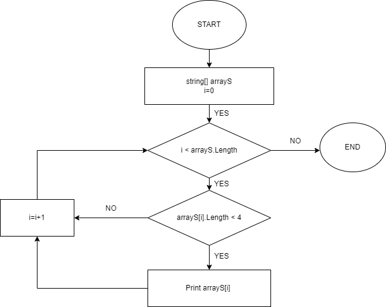

# Итоговая проверочная работа.

## Задача:
Написать программу, которая из имеющегося массива строк формирует новый массив из строк, длина которых меньше, либо равна 3 символам. Первоначальный массив можно ввести с клавиатуры, либо задать на старте выполнения алгоритма. При решении не рекомендуется пользоваться коллекциями, лучше обойтись исключительно массивами.

Примеры:
[“Hello”, “2”, “world”, “:-)”] → [“2”, “:-)”]
[“1234”, “1567”, “-2”, “computer science”] → [“-2”]
[“Russia”, “Denmark”, “Kazan”] → []

### Алгоритм:
1. Делаем перебор значений из исходного массива
2. Проверяем каждое значение из массива на соответствие условию: `длина строки меньше или равна трем`
3. Если строка удовлетворяет условию - выводим на экран.
4. Повторяем пункты `2` и `3` до тех пор пока не достигнем конца исходного массива

### Блок-схема:


### Программа:
Для запуска программы перейдите в папку `ITOG` и запустите команду через терминал:
```
dotnet run 
```
значения вводятся в файле `Program.cs` строка 7:
```
Введите значения в кавычках, через запятую внутри скобок {}
```
Пример вывода программы:
```
Hello | 2 | world | :- | Ad |  -->  2 |  :- |  Ad |
```